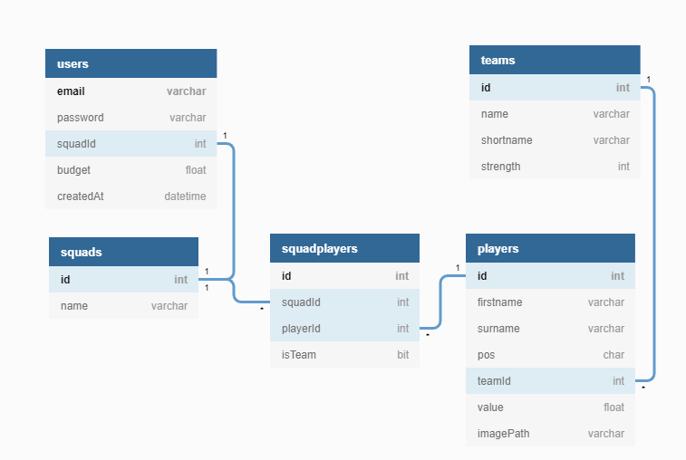

# Avanade Fundamental Project: Fantasy Football :soccer:

>***TASK***: To create a CRUD application with the utilisation of supporting tools,
> methodologies and technologies that encapsulate all core modules
> covered during training.

## Contents
1. [Introduction](#introduction)
2. [Requirements Analysis](#requirements)
  i. [Game Rules](#rules)
  ii. [Requirements](#requirements2)
3. [Architecture](#architecture)
  i. [Database Structure](#db)
4. [Planning](#planning)
5. [Risk Assessment](#risk)

## 1. Introduction 
The aim of this project is to create a simplified and minimal solution of the [Premier League Fantasy Football (game)](#https://fantasy.premierleague.com/). This document provides details of design and implementation of the project. Additonally, the data used within the project can be found [here](#https://github.com/vaastav/Fantasy-Premier-League).

## 2. Requirements Analysis 
### 2.1 Game Rules 
The **game** is a large and complex solution. Therefore the project will only use a subset of its rules. Please find them below:

A user of the web application has a **budget** of **£100m** to pick a squad of **15 different players** from the **Premier League**, consisting of: 

* 2 Goalkeepers (**GK**)
* 5 Defenders (**DEF**)
* 5 Midfielders (**MID**)
* 3 Forwards (**FWD**)

A squad can contain a **maximum** of **3 players** from a **single Premier League team**.

The starting **11 players** along with **4 substitutes** must be selected by the user. 

### 2.2 Requirements 
* User Accounts
  * The web application should allow a user to create an account
  * The web application should allow a user to log in 
  * The web application should allow a user to sign out of their account
  * The web application should allow a user to delete their account
* Squads
  * The web application should allow a user to create their squad
  * The web application should allow a user to save their squad
  * The web application should allow a user to view their squad
  * The web application should allow a user to transfer players in/out of their squad
  * The web application should allow a user to delete their squad
  * The web application should allow a user to choose their starting 11
  * The web application should allow users to select their substitutes
  * The web application should display the images of players

## 3. Architecture & Design 
### 3.1. Database Structure 
The project uses a single relational database containing 5 tables: users, squads, squadplayers, players, teams. The **entity relationship diagram** for the database is shown below:

## 4. Planning 
 The type of Kanban board used within this project is **Azure Boards**. The requirements gathered in [Section 2](#requirements) were used to create the **issues** inside of **Azure Boards** to track the implementation of features within the project.

## 5. Risk Assessment 

| Risk                                                             | Likelihood | Severity | Control Measure | Response                                                        | Revisit Date |
| ---------------------------------------------------------------- | ---------- | -------- | --------------- | --------------------------------------------------------------- | ------------ |
| A user obtains access to an account that does not belong to them | Low        | High     | Prevent         | Hash with a salt all passwords within users database            | N/A          |
| A user accidentally deletes their account                        | Low        | High     | Mitigate        | Ask for additioional confirmation before the account is deleted | 06/2021      |
| A user accidentally deletes their squad                          | Low        | Medium   | Mitigate        | Ask for additioional confirmation before the squad is deleted   | 06/2021      |

## 6. References
